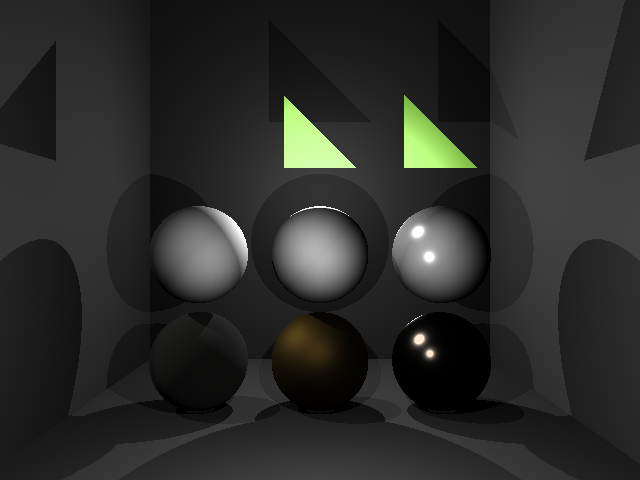
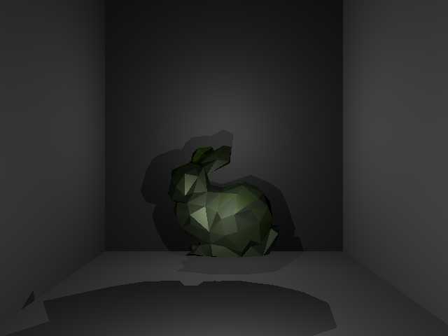

# Raytracer

This project was made for a module called Graphics Programming. It contains 2 scenes:
* Scene 1 contains several spheres all with different materials and 3 triangles. 1 with front-face culling, 1 with back-face culling, 1 with no culling. 

* Scene 2 contains the Stanford bunny

This raytracer can read obj files but only the vertices and faces.

## Materials
The project contains a few materials:
* Lambert Diffuse
* Lambert Cook Torrance
* Lambert Phong
